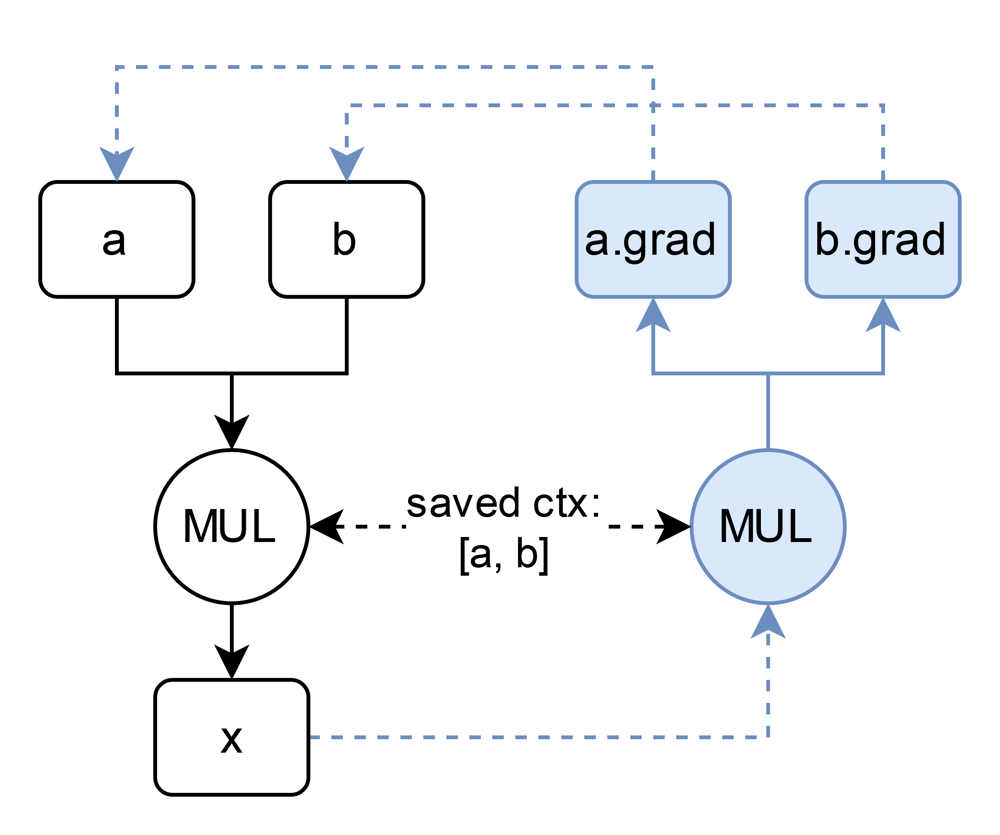
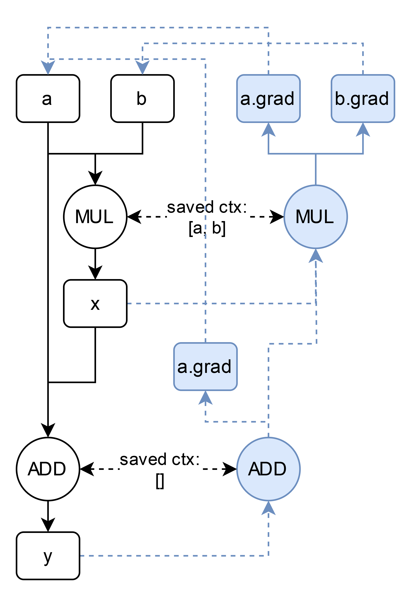

### [maligrad](https://maps.app.goo.gl/kZGt592YTsWSrcWA9) is a small NumPy-array-based autograd engine with an included NN library

NumPy being its only dependency, maligrad can do the majority of things numpy can:

```py
a = Variable(2 * np.ones((3, 3)), requires_grad=True)
b = Variable(3 * np.ones((3, 3)))

# addition
print(a + b)
>>> Variable(
    data=
    [[5. 5.]
     [5. 5.]]
    )

# multiplication
print(a * b)
>>> Variable(
    data=
    [[6. 6.]
     [6. 6.]]
    )

# matrix multiplication
print(a @ b[0])
>>> Variable(
    data=
    [12. 12.]
    )

# and much more
```

while also enabling reverse mode automatic differentiation:

```py
(a[0] * b).sum().backward()
print(a.grad)
>>> [[6., 6.],
     [0., 0.]]
```

# General info

The project was inspired by the great [micrograd](https://github.com/karpathy/micrograd).
If you watched the video tutorial or implemented micrograd yourself, you know that the engine is based on scalars.
While being really simple, it is still powerful enough to define pretty much any neural net.
The downside to that approach is, however, that it's not as efficient.

So, I wondered how much more work would be needed to make a similar automatic differentiation engine, but based on tensors / $N$-dimensional arrays, like it's done in [pytorch](https://github.com/pytorch/pytorch), for example.
I thought that things like broadcasting, indexing and all the other special array operations would complicate things a great deal.

It turns out that not that much is different.
For comparison, micrograd's engine is around 70 lines of code, while maligrad has roughly 330 lines under the hood.
And that includes all the extra operations that are not included in micrograd.
At the end, the broadcasting and array operation shenanigans sorted themselves out almost on their own (I attribute this to my great planning and look-ahead. No blind luck was involved.).

# How it works

At first, my computation graph was being constructed in much the same way as in Andrej Karpathy's [video lecture](https://www.youtube.com/watch?v=VMj-3S1tku0).
I decided to split the nodes into function and data nodes, however, since I knew that arrays would require more operations for basic functionality, and I wanted to split code to make it more manageable (this did not happen at the end, due to typing circular dependencies).

Later, I noticed that this approach, while being very simple, is not the most memory-efficient.
Not to go too deep into the details, but in essence, the compute graph I was constructing included all the tensors from all the intermediate compute results.
Think about it for a second.
While training, all the intermediate tensors that would otherwise get GC'd needed to stay in memory because they were nodes in the computation graph.
Better yet, the gradients were allocated at construction, which inflated the memory footprint twice as much.

This had to change, so I completely rewrote the engine from scratch after nearly calling the project a wrap.
Fortunately, I used unit tests, so the whole rewrite happened pretty much in a day.

Anyhow, here's how it works:.
Suppose, we want to know the gradients through the following computation:
```py
a = Variable(2, requires_grad=True)
b = Variable(3, requires_grad=True)
x = a * b # step 1
y = a + x # step 2

y.backward()
```
The first node that gets constructed is the multiplication node:



Output $x$ and everything in blue is generated by the multiplication node during the forward pass.
Also, the context needed in back propagation ($a$ and $b$ values) is saved.

The second step is much the same:



Instead of the multiplication, the addition node now generates the output $y$ and constructs the compute DAG needed for backprop.
The context is now empty, as addition only propagates the partial gradient to both inputs.
Notice that instead of refering to $x$'s gradient, the second arrow in ADD's backward pass points to MUL.

That is, essentially, it.
After you call $y$'s `.backward()`, the gradients flow through the blue graph and get deposited into the inputs.
There are certain other details and optimizations that are still needed for backprop to be successful, but they cannot be explained as quickly.

# Project structure

[`assets`](assets/) includes images for this markdown.

[`examples`](examples/) includes notebooks with neural net training examples.

[`maligrad`](maligrad/) includes the main juice.
[`autograd`](maligrad/autograd/) includes the automatic differentiation engine. If you have to check out one thing, look at this engine.
[`data`](maligrad/data/) includes a data engine similar to that of pytorch.
[`nn`](maligrad/nn/) includes a torch-style nn library. It can do convolutions. Check this one out if you are interested after checking out autograd.

[`tests`](tests/) test cases for maligrad. Same folder structure as in maligrad.

# Try it out

Install numpy if you still haven't:
```
pip install numpy
```

If you wish to run the example notebooks, also install jupyter and matplotlib:
```
pip install ipykernel matplotlib
```


# TODOs

I will probably never come around to doing any of these:

1) Inplace modifications are not supported and never will be. But some operations, like padding in convolution, would require a similiar operation.
It is probably the easiest to do something like an `.at` property in [JAX](https://jax.readthedocs.io/en/latest/_autosummary/jax.numpy.ndarray.at.html).

2) Currently, maligrad is pretty memory inefficient, because the compute graphs are longer than they need to be, since only a few basic ops have `Function` implementations. For example: division is implemented as `a / b = a * b ** -1`, which produces two nodes in DAG. This is not a lone example, so operator overrides at least should have an associated `Function`.

3) RNNs and other nn stuff.